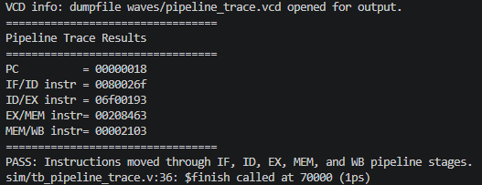
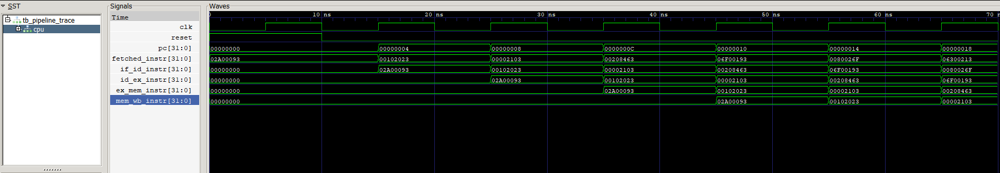
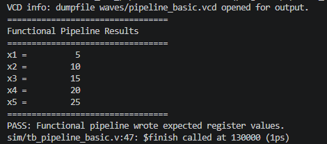
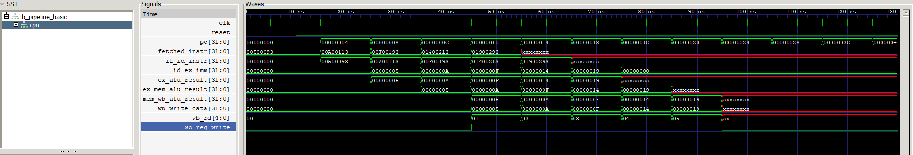

# RISC-V CPU Architecture

A Verilog implementation of a RISC-V CPU built from scratch and verified with Icarus Verilog and GTKWave.

The project currently includes a fully functional single-cycle CPU and an instruction-trace pipeline model used to validate instruction flow through a classic 5-stage pipeline architecture.
---

## Overview

The project currently includes a fully functional single-cycle CPU, memory and control-flow verification, a pipeline trace model, and a functional pipelined datapath capable of executing instructions through IF, ID, EX, MEM, and WB stages.

The long-term goal is to evolve the design into a fully pipelined RV32I processor with hazard detection, forwarding, and control-flow handling.

This CPU implements a small RV32I-style instruction subset and executes instructions from a hex-loaded instruction memory.

The first version focuses on a clean single-cycle datapath where each instruction completes in one clock cycle.

---

## Supported Instructions

- ADD
- SUB
- AND
- OR
- XOR
- ADDI
- LW
- SW
- BEQ
- JAL

---

## Architecture

```text
Program Counter
      │
      ▼
Instruction Memory
      │
      ▼
Control Unit
      │
      ▼
Register File
      │
      ▼
Immediate Generator
      │
      ▼
ALU
      │
      ▼
Writeback
```

---

## Modules

| Module | Purpose |
|---|---|
| `alu.v` | Performs arithmetic and logic operations |
| `regfile.v` | Implements 32 general-purpose registers |
| `control.v` | Decodes instruction fields into control signals |
| `imm_gen.v` | Generates immediates for instruction formats |
| `instr_mem.v` | Loads machine code instructions from hex files |
| `data_mem.v` | Provides memory support for future load/store tests |
| `cpu_single_cycle.v` | Connects all datapath components together |
| `cpu_pipeline_trace.v` | Demonstrates instruction movement through a 5-stage pipeline |
| `instr_mem_pipeline.v` | Instruction memory used by the functional pipeline |
| `cpu_pipeline_basic.v` | Functional 5-stage pipeline datapath implementation |

---


## Arithmetic and Logic Verification

This verification program tests arithmetic and logical instructions executed through the ALU and confirms correct register writeback behavior.


The waveform confirms correct instruction fetch, ALU execution, and register writeback for arithmetic and logical operations.

The waveform shows:

- clock and reset behavior
- program counter incrementing by 4
- instruction memory output changing each cycle
- ALU results matching instruction execution
- writeback data updating register values

---

## Memory and Control Flow Verification


This verification program tests memory operations and control-flow instructions.

The test confirms:

- SW stores values into data memory
- LW loads values back into registers
- BEQ correctly branches when registers match
- JAL stores a return address and jumps to the target instruction

Expected final state:

```text
x1 = 42
x2 = 42
x3 = 0
x4 = 24
x5 = 7
mem[0] = 42
```


The waveform shows successful memory access, branch execution, and jump behavior while the program counter advances through the instruction stream.

---

## Pipeline Stage Trace Verification

The project also includes a pipeline trace model used to verify instruction movement through a classic 5-stage pipeline.

Pipeline stages:

- IF (Instruction Fetch)
- ID (Instruction Decode)
- EX (Execute)
- MEM (Memory Access)
- WB (Write Back)





The waveform shows multiple instructions occupying different pipeline stages simultaneously.

Example pipeline state:

```text
IF/ID  = 0080026f
ID/EX  = 06f00193
EX/MEM = 00208463
MEM/WB = 00002103
```

This confirms that instructions advance through the IF, ID, EX, MEM, and WB stages one clock cycle at a time and establishes the foundation for a future pipelined implementation.

---

## Functional Pipeline Verification

After validating instruction movement through the pipeline, the next step was executing instructions through a functional pipelined datapath.

This implementation carries instruction data through the IF, ID, EX, MEM, and WB stages while preserving stage separation using pipeline registers. Arithmetic operations are executed by the ALU, propagated through the pipeline, and written back to the register file.

### Results



Verified register state:

```text
x1 = 5
x2 = 10
x3 = 15
x4 = 20
x5 = 25
```

### Waveform



The waveform shows instructions progressing through multiple pipeline stages simultaneously while intermediate values advance between stage registers. ALU results, destination registers, and writeback data can be observed moving through the datapath before being committed to the register file.

This verification confirms successful instruction execution through a functional 5-stage pipeline and establishes the foundation for future hazard detection, forwarding, and pipeline control logic.

---

## Running the Simulation

Compile:

```bash
iverilog -o sim/cpu_single_cycle.vvp src/*.v sim/tb_cpu_single_cycle.v
```

Run:

```bash
vvp sim/cpu_single_cycle.vvp
```

Open waveform:

```bash
gtkwave waves/cpu_single_cycle.vcd
```

---

## Repository Structure

```text
riscv-pipeline-cpu/
│
├── src/
│   ├── alu.v
│   ├── control.v
│   ├── cpu_single_cycle.v
│   ├── cpu_pipeline_trace.v
│   ├── cpu_pipeline_basic.v
│   ├── data_mem.v
│   ├── imm_gen.v
│   ├── instr_mem.v
│   ├── instr_mem_pipeline.v
│   └── regfile.v
│
├── sim/
│   ├── tb_cpu_single_cycle.v
│   ├── tb_pipeline_trace.v
│   └── tb_pipeline_basic.v
│
├── programs/
│   ├── alu_validation.hex
│   ├── memory_branch_jump.hex
│   └── pipeline_basic.hex
│
├── docs/
│   ├── alu-verification-output.png
│   ├── alu-verification-waveform.png
│   ├── control-flow-output.png
│   ├── control-flow-waveform.png
│   ├── pipeline-stage-trace.png
│   ├── pipeline-stage-trace-output.png
│   ├── functional-pipeline-output.png
│   └── functional-pipeline-waveform.png
│
└── README.md
```

---

## What This Demonstrates

- Verilog hardware design
- RISC-V instruction execution
- Single-cycle CPU datapath design
- Register file and ALU implementation
- Instruction decoding and control signals
- Waveform-based verification
- Computer architecture fundamentals
- Five-stage pipeline fundamentals
- Pipeline register design
- Instruction flow visualization
- Functional pipelined datapath design
- Pipeline register implementation
- Multi-stage instruction execution
- Register writeback verification

---

## Next Steps

- Expand the RV32I instruction subset
- Add additional load and store variants
- Add hazard detection and forwarding
- Support pipeline stalling and flushing
- Execute larger RISC-V programs
- Expand the instruction subset