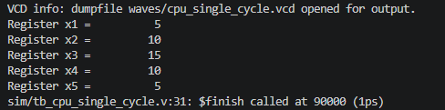
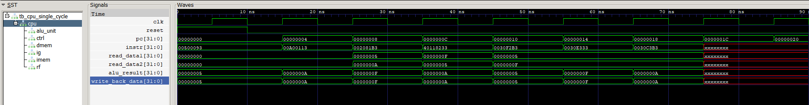
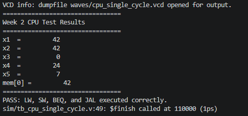
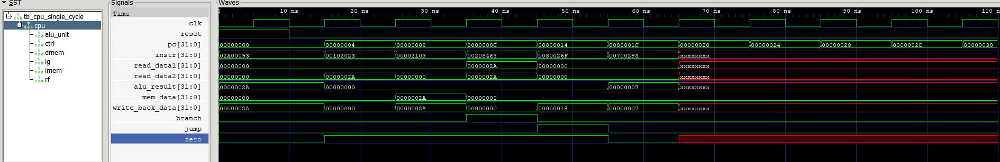

# RISC-V Single Cycle CPU

A Verilog implementation of a small single-cycle RISC-V CPU core built from scratch and verified with Icarus Verilog and GTKWave.

This project was built to practice computer architecture concepts including instruction fetch, decode, register files, ALU execution, control signals, program counter updates, and waveform-based debugging.

---

## Overview

This project currently supports arithmetic, logical, memory, branch, and jump instructions and serves as the foundation for a future pipelined RISC-V processor.

This CPU implements a small RV32I-style instruction subset and executes instructions from a hex-loaded instruction memory.

The first version focuses on a clean single-cycle datapath where each instruction completes in one clock cycle.

---

## Supported Instructions

- ADD
- SUB
- AND
- OR
- XOR
- ADDI
- LW
- SW
- BEQ
- JAL

---

## Architecture

```text
Program Counter
      │
      ▼
Instruction Memory
      │
      ▼
Control Unit
      │
      ▼
Register File
      │
      ▼
Immediate Generator
      │
      ▼
ALU
      │
      ▼
Writeback
```

---

## Modules

| Module | Purpose |
|---|---|
| `alu.v` | Performs arithmetic and logic operations |
| `regfile.v` | Implements 32 general-purpose registers |
| `control.v` | Decodes instruction fields into control signals |
| `imm_gen.v` | Generates immediates for instruction formats |
| `instr_mem.v` | Loads machine code instructions from hex files |
| `data_mem.v` | Provides memory support for future load/store tests |
| `cpu_single_cycle.v` | Connects all datapath components together |

---

## Arithmetic and Logic Verification

This verification program tests arithmetic and logical instructions executed through the ALU and confirms correct register writeback behavior.





The waveform confirms correct instruction fetch, ALU execution, and register writeback for arithmetic and logical operations.

The waveform shows:

- clock and reset behavior
- program counter incrementing by 4
- instruction memory output changing each cycle
- ALU results matching instruction execution
- writeback data updating register values

---

## Memory and Control Flow Verification



This verification program tests memory operations and control-flow instructions.

The test confirms:

- SW stores values into data memory
- LW loads values back into registers
- BEQ correctly branches when registers match
- JAL stores a return address and jumps to the target instruction

Expected final state:

```text
x1 = 42
x2 = 42
x3 = 0
x4 = 24
x5 = 7
mem[0] = 42
```



The waveform shows successful memory access, branch execution, and jump behavior while the program counter advances through the instruction stream.

---

## Running the Simulation

Compile:

```bash
iverilog -o sim/cpu_single_cycle.vvp src/*.v sim/tb_cpu_single_cycle.v
```

Run:

```bash
vvp sim/cpu_single_cycle.vvp
```

Open waveform:

```bash
gtkwave waves/cpu_single_cycle.vcd
```

---

## Repository Structure

```text
riscv-pipeline-cpu/
│
├── src/
│   ├── alu.v
│   ├── control.v
│   ├── cpu_single_cycle.v
│   ├── data_mem.v
│   ├── imm_gen.v
│   ├── instr_mem.v
│   └── regfile.v
│
├── sim/
│   └── tb_cpu_single_cycle.v
│
├── programs/
│   ├── alu_validation.hex
│   └── memory_branch_jump.hex
│
├── waves/
│   └── cpu_single_cycle.vcd
│
├── docs/
│   ├── alu-verification-output.png
│   ├── alu-verification-waveform.png
│   ├── control-flow-output.png
│   └── control-flow-waveform.png
│
└── README.md
```

---

## What This Demonstrates

- Verilog hardware design
- RISC-V instruction execution
- Single-cycle CPU datapath design
- Register file and ALU implementation
- Instruction decoding and control signals
- Waveform-based verification
- Computer architecture fundamentals

---

## Next Steps

- Expand the RV32I instruction subset
- Add additional load and store variants
- Implement a 5-stage pipeline
- Add hazard detection and forwarding
- Support pipeline stalling and flushing
- Execute larger RISC-V programs